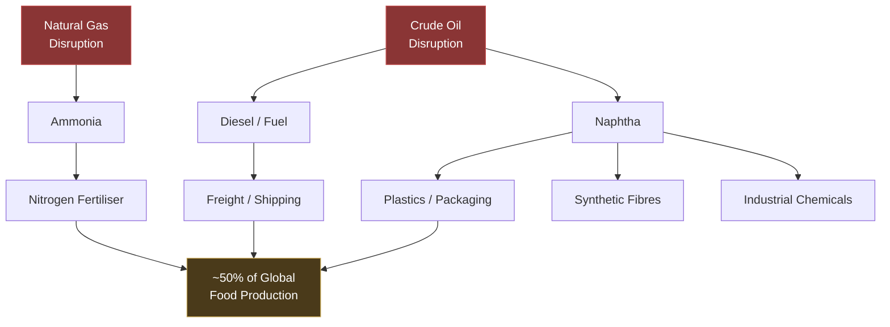

## Preface: From Theoretical Risk to Operational Reality

In *Contested Ground*, we described three forces pressing simultaneously on global oil markets: the sanctions-driven reshuffling of trade flows, China's renewable compression of demand growth, and the rising consumption profiles of Asia's population centres. That essay was written into a world where the Strait of Hormuz was a theoretical risk — the classic "what if" of energy security modelling, discussed for decades but never actualised.[^1]

On February 28, 2026, the theoretical became operational.

This essay examines what changes when the chokepoint activates. It is not a commentary on the conflict itself — the humanitarian and environmental consequences within the region are self-evidently severe and deserve separate treatment. What follows is the systems view: how physical geography, financial geography, and economic geography interact when the world's most consequential energy corridor goes dark.

---

## Part A: The Geography of Concentration

To understand the current crisis is to understand the Persian Gulf not as a region that produces oil, but as a system in which the entire vertical — upstream extraction, midstream processing and transport, and downstream refining and export — is compressed into a narrow geographic corridor. Scroll through the five geographic facts below.

<section class="story-section">
  

    

      

    

  

  

    

      
<strong>The Persian Gulf as a System.</strong> No other region on Earth concentrates this much energy infrastructure in this little space, and no other chokepoint channels this large a fraction of global supply through a passage barely 34 kilometres wide at its narrowest point. Understanding the current crisis requires understanding this geography as a <em>system</em>, not a collection of independent facilities.

    

    

      
<strong>Upstream: Where the Oil Comes From.</strong> Five countries — Saudi Arabia, Iraq, the UAE, Kuwait, and Iran — account for approximately 93.6% of all crude and condensate volumes transiting Hormuz. Their fields sit within a few hundred kilometres of the Gulf coast: Ghawar 100 km inland, Basra fields feeding directly to the Basra Oil Terminal, Kuwait's entire export infrastructure facing the Gulf, UAE fields offshore, Iran's Kharg Island terminal in the northern Gulf.

      
The geographic fact is plain: there is no inland alternative for the bulk of this production. The oil must cross water. And the water narrows to Hormuz.

    

    

      
<strong>Midstream: The Chokepoint.</strong> In 2024, approximately 20 million barrels per day of oil flowed through the Strait of Hormuz — roughly 20% of global petroleum liquids consumption and over 31% of all seaborne crude flows. Additionally, about 20% of global LNG exports — primarily from Qatar — transit the same waterway.

      
Alternative bypass routes cover perhaps a third of normal Hormuz flows. There is no engineering substitute for an open strait.

    

    

      
<strong>Downstream: The Blast Radius.</strong> The Gulf's downstream infrastructure sits directly on or near the coast: Ras Tanura (550,000 b/d refinery and export terminal), Ras Laffan (~20% of global LNG), ADNOC facilities offshore Abu Dhabi, Kuwait's Mina Al-Ahmadi complex. All are within drone range of Iran.

      
The 2019 Abqaiq attack proved the vulnerability: a limited drone strike temporarily knocked out more than half of Saudi Arabia's crude production.

    

    

      
<strong>The Destination Geography.</strong> 84% of crude oil and condensate transiting Hormuz in 2024 was destined for Asian markets: China 37.7%, India 14.7%, South Korea 12.0%, Japan 10.9%. The United States receives just 2.5%.

      
When the strait closes, it is Asia — not Europe, not North America — that absorbs the immediate physical shortage.

    

  

</section>

The following chart summarises the export origin concentration.

And the destination concentration.

---

## Part B: The Strait Closes — Not by Decree, but by Insurance

A persistent misunderstanding in public discourse frames strait closure as a binary event: Iran either formally closes the Strait of Hormuz, or it does not. The reality that has unfolded since February 28 is more instructive. The strait was closed not by an official Iranian decree, but by the market itself.

### The Sequence

The United States and Israel initiated coordinated airstrikes on Iran on February 28, 2026, under what was designated Operation Epic Fury, targeting military facilities, nuclear sites, and regime leadership — including a strike that killed Supreme Leader Ali Khamenei.[^7] Iran's response was immediate and geographically distributed: retaliatory missile and drone attacks on Israeli territory and US military bases across the Gulf, including facilities in Qatar, the UAE, Kuwait, Bahrain, Jordan, Saudi Arabia, Iraq, and Oman.[^8]

Within hours, the IRGC broadcast VHF transmissions on international maritime distress frequencies stating that no ship was permitted to pass the Strait of Hormuz. Every vessel in the area received the message. Most paused immediately.[^9]

By March 2, an IRGC commander officially confirmed the strait was closed and threatened any vessel attempting passage. At least five tankers had been struck near the strait, two crew members killed, and over 150 vessels had anchored outside it.[^10] Just after midnight on March 2, no tankers in the strait were broadcasting automatic identification system signals — indicating near-zero traffic.

But the decisive mechanism was economic, not military. Protection and indemnity insurance — the coverage that indemnifies shipowners against third-party liabilities — was withdrawn effective March 5. War-risk premiums, already at six-year highs before the strikes (having risen from 0.125% to 0.2–0.4% of ship value per transit in the days prior), became effectively unpriceable. Major container shipping companies including Maersk and Hapag-Lloyd suspended transits.[^11]

The following diagram traces the cascade:

### Infrastructure Damage Across the Gulf

Iran's retaliation moved beyond military targets to critical energy assets — a deliberate escalation from the tanker harassment tactics employed by Houthi forces in the Red Sea through 2024.[^12]

| Facility | Country | Type | Capacity | Status (3 Mar) |
|---|---|---|---|---|
| Ras Tanura Refinery | Saudi Arabia | Refinery + export terminal | 550,000 b/d | Shut down (precautionary, after drone debris fire) |
| Ras Laffan Industrial City | Qatar | LNG complex | ~20% of global LNG | Halted (drone strike; force majeure declared) |
| Mesaieed Industrial City | Qatar | LNG + petrochemicals | Major | Halted (drone strike) |
| Iraqi Kurdistan fields | Iraq | Upstream (multiple operators) | ~200,000 b/d | Suspended (precautionary) |
| Israeli gas fields | Israel | Upstream (gas) | Several major | Suspended |
| Fujairah Port | UAE | Storage + terminal hub | Major regional hub | Fire reported |

The Ras Laffan strike warrants particular attention. It is not just another industrial facility — it is the centre of Qatar's LNG export system and a pillar of global gas supply. QatarEnergy is the world's second-largest LNG exporter after the United States, and its Asian clients represent 82% of its customer base.[^13] Any prolonged outage immediately tightens European and Asian gas markets.

### The Price Response

The cost escalation was immediate and compound.[^14]

Supertanker rates from the Middle East to China surged over 94% to an all-time record of approximately $424,000 per day. Shipping costs rose by $1,500 for a standard 20-foot container and $3,500 for specialty cargo. European gas benchmark prices (Dutch TTF) surged more than 25% on the Qatar production halt alone, to over €39 per megawatt hour. The S&P Global Asia LNG benchmark (JKM) hit $15.07/MMBtu.

| Benchmark | Pre-crisis (Feb 27) | Current (Mar 3) | Change |
|---|---|---|---|
| Brent Crude | ~$69/bbl | ~$84/bbl | +22% |
| WTI | ~$64/bbl | ~$77/bbl | +20% |
| Dutch TTF Natural Gas | ~€32/MWh | €39+/MWh | +25% |
| VLCC Rate (ME → China) | ~$218K/day | ~$424K/day | +94% |
| War-risk insurance (per transit) | 0.125% ship value | Effectively withdrawn | — |
| Container surcharge | Baseline | +$1,500–3,500/box | — |

> **For Alberta's oil sands:** The price upside that was suppressed by the shadow-fleet discount described in *Contested Ground* has been partially released. WTI at $77 approaches the threshold where greenfield SAGD projects become economically viable (~$80 WTI equivalent). But the critical variable is duration: if the conflict resolves in weeks, the spike fades. If the strait remains effectively closed for months, the investment calculus changes materially — and Alberta's Pacific-facing export route via TMX becomes one of the most strategically valuable crude oil pathways in the world.

---

## Part C: Who Loses the Oil

The disruption is not evenly distributed. It falls disproportionately on Asia, which receives 84–89% of all crude oil and condensate transiting Hormuz.[^15] The concentration of exposure among a handful of major economies creates a vulnerability profile that no amount of strategic petroleum reserves can fully address in a sustained disruption.

<section class="story-section">
  

    

      

    

  

  

    

      
<strong>Japan and South Korea: Maximum Structural Exposure.</strong> Japan imports all of its oil; approximately 72% of those imports transit the Strait of Hormuz. South Korea's dependence is roughly 65%. Both nations have substantial strategic petroleum reserves — but reserves are designed to bridge short disruptions, not sustained blockades.

      
South Korea's net oil imports represent 2.7% of GDP. Japan's Nikkei fell 1.3% on the first trading day after the strikes.

    

    

      
<strong>India: The Dual Shock.</strong> India faces the largest combined exposure in Asia. More than 60% of its oil imports originate in the Middle East. Over half of its LNG imports are Gulf-linked and Brent-indexed — meaning a Hormuz-driven crude spike simultaneously raises both oil import costs and LNG contract prices: a "dual physical and financial shock."

      
India also subsidises domestic fuel and fertiliser heavily. A sustained price spike compresses fiscal space, forcing trade-offs between subsidies and other public spending.

    

    

      
<strong>China: Exposed but Buffered.</strong> China enters this crisis better positioned than any other major importer. Through aggressive purchasing of discounted Russian and Iranian crude throughout 2024&#8202;–&#8202;25, China built substantial strategic petroleum reserves. Only about 40% of its oil imports transit Hormuz, and it has pipeline-delivered crude from Russia and Central Asia.

      
China purchases more than 80% of Iranian oil exports, so the loss of Iranian production (~3.3 million b/d) affects China's supply chain specifically. Roughly 30% of China's LNG imports also come from Qatar and the UAE.

    

    

      
<strong>Thailand and Southeast Asia: Cost Amplifiers.</strong> Thailand's net oil imports represent 4.7% of GDP — the highest in Asia. Each 10% rise in oil prices worsens its current account by approximately 0.5 percentage points. Across the Philippines, Indonesia, and Thailand, the first-order hit is cost inflation rather than an immediate physical shortage.

      
Malaysia, as a net energy exporter, is a relative beneficiary — an asymmetry that underlines the redistributive rather than purely destructive character of a supply disruption.

    

  

</section>

---

## Part D: Beyond Oil — The Propagation Channels

One of the most persistent failures in public energy discourse is the treatment of oil as a single-use commodity — as though its primary function were to power automobiles and nothing more. In *Contested Ground*, we noted that petrochemical feedstocks would account for more than 60% of all new demand growth by 2026, and that the IEA projects petrochemicals will drive over a third of oil demand growth through 2030.[^20] The corollary is that disrupting oil supply does not merely raise the price of petrol. It propagates through every sector that depends on petroleum-derived inputs — and those sectors are far broader than most people recognise.

### The Petrochemical Backbone

Petrochemical feedstock — primarily naphtha derived from crude oil refining, and ethane from natural gas — produces the plastics, synthetic fibres, adhesives, lubricants, detergents, medical equipment, packaging, and industrial chemicals that constitute the material infrastructure of modern economies. Petrochemicals are now the single largest growth driver of global oil demand, having overtaken transportation.

The Gulf states are not peripheral to this system. Saudi Aramco's 2020 acquisition of a 70% stake in SABIC — the world's fourth-largest chemical company — was specifically designed to integrate petrochemical production with upstream oil.[^21] Qatar's Ras Laffan is not merely an LNG facility; it is an integrated petrochemical hub. The attacks on these facilities do not merely remove energy from the market. They remove industrial feedstocks.

### The Food System

Oil price movements influence as much as 64% of food price variation, according to World Bank analysis.[^22] The transmission channels are multiple and reinforcing: diesel powers the trucks and ships that move food; natural gas produces the ammonia that becomes nitrogen fertiliser (underpinning roughly half the world's food production); petrochemical-derived packaging preserves food through supply chains that span continents; and petroleum-based agrochemicals protect crops from pathogens. A sustained oil price spike tightens every one of these channels simultaneously.

### The LNG Dimension

The Qatar production halt compounds the oil disruption with a parallel gas crisis. QatarEnergy supplies roughly 20% of global LNG. European gas benchmark prices surged 25% on the Qatar halt alone. For European manufacturers still adjusting to the loss of Russian pipeline gas after 2022, a simultaneous disruption to their primary LNG replacement source is a structural threat to energy costs and industrial competitiveness.[^23]

Asian LNG buyers face a different but equally acute problem: spot-reliant purchasers must now compete with Europe for Atlantic Basin cargoes, driving prices higher for both regions simultaneously.

---

## Part E: The Disproportionate Geographies

Beyond the immediate energy-importing economies, the propagation effects create a second ring of disproportionate impact in regions that are simultaneously oil-dependent, food-insecure, and institutionally fragile.

### Sub-Saharan Africa

Sub-Saharan Africa imports nearly all of its refined petroleum products and a growing share of fertiliser. Food inflation was already running at double-digit rates — Nigeria at 17.1%, Angola at 14.8%, Zambia at 10.8%, Ethiopia at 10.1% — before the current crisis, according to FAO projections.[^24] The region's food systems are acutely sensitive to both oil prices (via transport and fertiliser costs) and to exchange rates (currencies under pressure depreciate further when oil import bills surge, creating a vicious spiral).

During the 2022 energy shock, the number of people in acute food insecurity in Sub-Saharan Africa rose by 22 million.[^25] The current crisis arrives without meaningful recovery from that episode.

### South and Southeast Asia

India's dual exposure — oil and LNG simultaneously — makes it perhaps the single most consequentially exposed major economy beyond direct conflict participants. The Philippines, Thailand, and Indonesia share structural vulnerabilities: high oil import dependence, significant food import bills, and currencies sensitive to current account deterioration.

### Latin America

In Latin American economies with currency instability — Argentina, Colombia, Ecuador — the combination of higher dollar-denominated oil costs and weaker local currencies amplifies food price movements beyond what the oil price alone would suggest. Empirical research consistently finds that the oil price and exchange rate jointly explain the majority of food inflation variance in the region, with their effects becoming larger over time rather than dissipating.[^26]

> **The compounding effect:** Each previous oil disruption — 1973, 1979, 1990, 2019, 2022 — affected one or two supply channels. This crisis activates crude oil flows, LNG supply, petrochemical feedstock production, and downstream refining capacity simultaneously, across every major Gulf producer state, through a chokepoint that was closed not by military blockade but by the withdrawal of commercial insurance. And it arrives into an existing tariff environment that has already elevated trade frictions and shipping costs globally.

---

## Part F: Market Response and the Duration Variable

The market response in the first 72 hours has been sharp but not yet catastrophic — Brent at $84, up 22% from pre-crisis levels. This relative restraint reflects several countervailing factors. OPEC+ announced a larger-than-expected output increase of 206,000 barrels per day starting in April.[^27] The global market entered 2026 with approximately 1.5 million barrels per day of oversupply.[^28] And traders have not yet priced in worst-case scenarios of sustained infrastructure damage.

Oxford Economics assesses that Iran cannot win a conventional military contest but can inflict material economic damage through Gulf disruption. Their recommendation — sell extreme price spikes because the conflict will not last beyond two months — represents the consensus trading view.[^29] But this consensus depends on assumptions about rational de-escalation that may not hold when the stated objective is regime change.[^30]

The duration variable is everything. What is already clear, regardless of duration, is that the pre-crisis oversupply buffer of approximately 1.5 million barrels per day is entirely insufficient to offset 15–20 million barrels per day of Hormuz flows. OPEC+ can increase production, but much of that additional production must itself transit Hormuz to reach Asian buyers. Saudi Arabia's East-West pipeline can redirect some volume to Red Sea ports, but at a fraction of the scale needed. The arithmetic is unforgiving.

If a sustained oil price increase to $100 per barrel materialises — a scenario analysts now describe as plausible if infrastructure damage proves extensive — Capital Economics estimates it could add 0.6–0.7 percentage points to global inflation.[^31] In developing economies where food-price inflation already runs at double the advanced-economy norm, the effect is amplified further.

---

### Explore the Propagation Model

The analysis above rests on region-level elasticities that vary substantially — Japan's 72% Hormuz dependence versus Canada's zero, Sub-Saharan Africa's 70% food-channel transmission versus the United States' 30%. The simulator below lets you vary the shock parameters and watch how those structural differences translate into different impact profiles across 12 world regions over 24 months.

---

## Part G: Updating the Contested Ground Framework

In *Contested Ground*, we described three forces acting on the global oil market. The 2026 Iran conflict introduces a fourth — or, more precisely, converts a latent variable into an active one.

**Force I — The Sanctions Reshuffle.** Remains operative. Russian discounted crude continues to flow via shadow fleet. But Iran's own production — roughly 3.3 million barrels per day of crude plus 1.3 million barrels per day of condensate — is now directly at risk from conflict damage. This removes one of the structural price-floor suppliers identified in *Contested Ground*.

**Force II — The Renewable Compression.** Unchanged in medium-term trajectory. China's EV adoption and solar buildout continue to compress demand growth. But the immediate crisis overrides demand-side analysis: supply shocks dominate in the short run.

**Force III — The Demand Rise of the Global South.** Severely complicated. Rising economies that were expected to drive incremental oil demand — India, Southeast Asia, Africa — are now the economies most exposed to supply disruption and price-driven inflation. The demand growth curve analysed in *Contested Ground* depended on affordable energy inputs; that assumption is now under stress.

**Force IV — The Chokepoint Activation.** New. The theoretical risk of Hormuz disruption, discussed for decades, is now an operational reality. The entire Gulf value chain — upstream, midstream, downstream, LNG, petrochemicals — is under simultaneous stress. This is not a supply constraint in one channel but a system-wide disruption across the most geographically concentrated energy corridor on Earth.

### What This Means for Alberta

Alberta's position in this reconfigured landscape is paradoxical but structurally advantageous. The Trans Mountain Expansion pipeline, analysed in *Contested Ground* as a strategic reorientation toward Asian markets, has become more valuable precisely because it routes Canadian heavy crude to the Pacific coast — bypassing every chokepoint currently under stress. No Red Sea. No Strait of Hormuz. No Bab-el-Mandeb. No Suez. The crude loads at Burnaby or the Westridge Marine Terminal and sails west across the open Pacific.[^32]

If Asian buyers — particularly China, Japan, and South Korea — face sustained uncertainty about Gulf supply, the premium on non-Gulf, non-sanctioned, geopolitically stable crude increases materially. Canada is one of very few suppliers that can credibly offer all three attributes at scale. The question remains whether this advantage is transient (a weeks-long crisis) or structural (a lasting revaluation of supply security). Alberta's capital investment decisions in 2026 and 2027 will be shaped by the answer.

The bitumen insight from *Contested Ground* holds with added force: if disrupted Gulf petrochemical production forces Asian buyers to seek alternative hydrocarbon feedstocks, Alberta's bitumen — rich in long-chain hydrocarbons suitable for chemical conversion — becomes valuable not merely as a fuel source but as a petrochemical input. The TMX pipeline does not merely open an energy export route. It opens a materials supply route into the world's largest and most disrupted petrochemical market.

---

## Conclusion: What Systems See

The lesson, stated plainly, is concentration risk. The world built its energy system around the assumption that a 34-kilometre-wide strait between Iran and Oman would always remain open. That assumption has been tested before and survived. Whether it survives this test — and what the world looks like if it doesn't — is the defining energy question of 2026.

What distinguishes this crisis from its predecessors is not the scale of the military operation or the price of crude oil on any given day. It is the simultaneity. Previous disruptions — 1973, 1979, 1990, 2019, 2022 — each affected one or two supply channels. This crisis activates crude oil flows, LNG supply, petrochemical feedstock production, and downstream refining capacity simultaneously, across every major Gulf producer state, through a chokepoint that was closed not by military blockade but by the withdrawal of the commercial insurance that underpins global shipping.

The propagation is not theoretical. It is already measurable: in the 22% rise in Brent, in the record supertanker rates, in the force majeure declaration on Qatari LNG, in the shutdown of the world's largest refinery by a drone that cost a fraction of a single day's production value. And behind the price movements, the second-order effects are beginning: tighter fertiliser markets, higher food import bills, compressed fiscal space in the developing economies least equipped to absorb the shock.

For Alberta, the moment is clarifying. The long-term structural forces analysed in *Contested Ground* — demand-side compression from renewables, the petrochemical pivot, the geographic diversification of export routes — remain operative. But the immediate effect of the 2026 crisis is to demonstrate, in real time and at global scale, the value of supply diversity. A country that can produce crude oil, deliver it to Asian markets without transiting any contested waterway, and supply it from one of the most politically stable jurisdictions on Earth holds a position that no amount of sanctions architecture, shadow-fleet logistics, or strategic petroleum reserves can replicate.

The strait is 34 kilometres wide. The world built its energy system as though it were infinite.

---

## Notes and References

[^1]: See [*Contested Ground*](/global-energy-markets/) for the foundational framework. This essay is a direct continuation and assumes familiarity with the shadow fleet, the renewable tide, and the demand profiles analysed there.

[^2]: EIA, 'The Strait of Hormuz remains critical oil chokepoint,' *Today in Energy*, June 2025. Oil flow through the strait averaged 20 million b/d in 2024.

[^3]: EIA analysis based on Vortexa tanker tracking, Q1 2025. Saudi Arabia alone contributes 37.2% of total Hormuz crude flows.

[^4]: Kpler estimates 13 million b/d of crude passed through in 2025, representing 31% of all seaborne crude flows. The wider EIA figure of 20 million b/d includes petroleum products and condensate.

[^5]: Ras Laffan Industrial City is the single largest LNG production complex in the world. QatarEnergy's Asian clients represent 82% of its customer base.

[^6]: EIA / Vortexa tanker tracking. China receives 37.7% of all Hormuz crude, India 14.7%, South Korea 12.0%, Japan 10.9%. The United States receives just 2.5%.

[^7]: Wikipedia, '2026 Israeli–United States strikes on Iran.' The strikes followed the failure of indirect nuclear negotiations mediated by Oman and a second round in Geneva. Iran had signalled potential Hormuz disruptions in the weeks prior, including a temporary partial closure in mid-February as a warning.

[^8]: Al Jazeera, 'Multiple Arab states that host US assets targeted in Iran retaliation,' 28 February 2026. Oman was the only GCC state not struck — consistent with its role as diplomatic intermediary.

[^9]: Al Jazeera, 'Shutdown of Hormuz Strait raises fears of soaring oil prices,' 3 March 2026. As Cormac McGarry of Control Risks noted: 'Every ship in the area would have heard that… and it was enough for most ships to pause.'

[^10]: Wikipedia, '2026 Strait of Hormuz crisis.' Late on February 28, outgoing traffic was heavy while ingoing traffic was light. By early March 2, no tankers in the strait were broadcasting AIS signals.

[^11]: As Lloyd's List put it: 'The Strait is closed — not by Iran, but by shipping itself.' Cited in multiple analyses of the 2026 Hormuz crisis.

[^12]: Middle East Forum, 'Iran's War on Gulf State Energy Infrastructure Reverberates Beyond Oil and Gas,' 3 March 2026. Amena Bakr of Kpler described the strikes on energy installations as 'a turning point' that 'opens a new chapter where you're exposing the entire system, the entire oil facilities in the Gulf to these kinds of attacks.'

[^13]: Reuters / CNBC, 2 March 2026. Qatar declared force majeure on LNG shipments following the production halt. Two drones launched from Iran struck facilities at Ras Laffan Industrial City and Mesaieed Industrial City.

[^14]: CNBC, 'Oil supertanker rates hit all-time high as insurers drop war risk protection in the Middle East,' 3 March 2026.

[^15]: Visual Capitalist, 'Charted: Oil Trade Through the Strait of Hormuz by Country,' 3 March 2026, based on EIA / Vortexa data.

[^16]: CNBC, 'Strait of Hormuz closure: which countries will be hit the most,' 3 March 2026, citing Nomura and UBP analysis.

[^17]: CNBC, citing UBP analysis. India's exposure is unique in combining high oil import dependence with substantial Brent-indexed LNG contracts, creating correlated risk across energy categories.

[^18]: Kpler analysis cited in The National (UAE), 2 March 2026: 'China is relatively well-positioned due to large stockpiles accumulated last year through aggressive buying of discounted Russian and Iranian barrels.'

[^19]: CNBC, citing Nomura framework. Thailand's external hit is 'large and immediate' — the biggest net oil imports in Asia relative to GDP.

[^20]: IEA, *The Future of Petrochemicals*. Petrochemical feedstock accounts for approximately 12% of global oil demand, a share expected to increase. Synthetic nitrogen fertilisers — derived from natural gas via ammonia — underpin roughly half the world's food production.

[^21]: SABIC was founded in 1976 to capitalise on associated gas that was being flared during oil production. By 2018 it was the fourth-largest chemical company worldwide. Aramco's 70% acquisition created a vertically integrated crude-to-chemicals entity.

[^22]: World Ports Organisation / World Economic Forum, citing World Bank data. The transmission channels are multiple: diesel for freight, natural gas for ammonia-based fertiliser, petrochemical packaging, and agrochemicals.

[^23]: Al Jazeera, 'Gas prices soar as QatarEnergy halts LNG production after Iran attacks,' 2 March 2026. Dutch TTF benchmark rose more than 25%.

[^24]: Visual Capitalist, 'Mapped: Where Food Inflation Will Hit Hardest in 2026,' based on FAO projections across 160 countries. Iran itself tops the list at 55.9% projected food inflation — projections made before the conflict.

[^25]: World Bank / WFP, cited by World Ports Organisation. High fuel and food prices have been empirically correlated with mass protests, political violence, and government instability across developing economies.

[^26]: Aydın and Esen (2022), 'The effects of the oil price and temperature on food inflation in Latin America,' *Humanities and Social Sciences Communications*.

[^27]: Al Jazeera, 'Oil prices rise sharply after US, Israeli attacks on Iran,' 2 March 2026. The OPEC+ decision was taken in a meeting planned before the war began. The countries boosting output are Saudi Arabia, Russia, Iraq, the UAE, Kuwait, Kazakhstan, Algeria, and Oman.

[^28]: Kpler data cited in The National (UAE). 'That buffer could evaporate quickly if refining or upstream capacity is taken offline by prolonged Iranian attacks.'

[^29]: Oxford Economics / Alpine Macro, 'The 2026 Iran War: An Initial Take and Implications,' 3 March 2026.

[^30]: In his March 1 video statement, President Trump said the purpose of the strikes was 'effectively regime change,' urging IRGC members to 'lay down your weapons and have complete immunity, or in the alternative, face certain death.'

[^31]: Al Jazeera, citing Hamad Hussain of Capital Economics, 1 March 2026. 'If crude oil prices were to rise to $100 per barrel and remain at those levels for a while, that could add 0.6–0.7 percent to global inflation.'

[^32]: See *Contested Ground* Part A for the TMX routing analysis. The pipeline explicitly creates a routing advantage for Canadian crude into Asian markets — an advantage that becomes more pronounced when Gulf-to-Asia routes are disrupted.

---

### Further Reading

- U.S. Energy Information Administration, "Amid regional conflict, the Strait of Hormuz remains critical oil chokepoint," *Today in Energy*, June 2025.
- IEA, *The Future of Petrochemicals: Towards More Sustainable Plastics and Fertilisers*, 2018.
- Oxford Economics / Alpine Macro, "The 2026 Iran War: An Initial Take and Implications," 3 March 2026.
- Columbia University CGEP, "US-Israeli Attacks on Iran and Global Energy Impacts," 2 March 2026.
- American Action Forum, "Global Oil Market Implications of U.S.-Israel Attack on Iran," 2 March 2026.
- World Bank, *Commodity Markets Outlook*, October 2024.

*Market data as of 3 March 2026 morning. This essay will be updated as the situation develops.*
