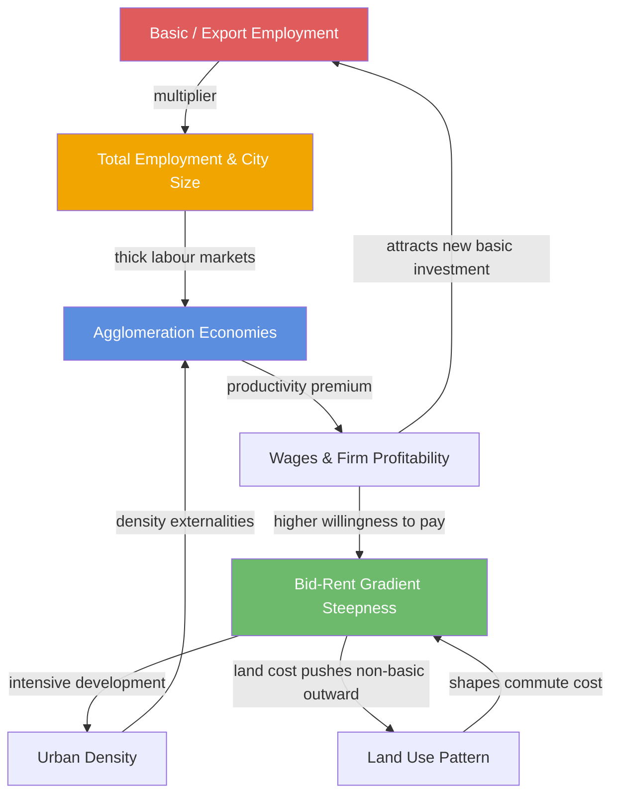

In the four preceding models, we built four distinct analytical tools. The bid-rent model explained why land rent falls with distance from the centre and how each land use type bids for the locations where it is most productive. The agglomeration model explained why density raises productivity and why specialised cities like Calgary earn wage premiums but carry fragility risk. Zipf's Law showed that the national hierarchy of cities follows a predictable statistical regularity, with Alberta's near-equal Edmonton-Calgary pair as a notable exception. And the economic base model showed how basic export employment drives total employment through the multiplier.

These are not independent frameworks. They describe the same urban system from four different angles. The bid-rent gradient shapes population density; density enables agglomeration; agglomeration determines productivity and wages; wages feed the economic base and determine how large the multiplier is; the size of the city in the national hierarchy determines the depth of its labour market and the richness of its agglomeration externalities. And around again: agglomeration bids up land values, reshaping the rent gradient. The system is circular, self-reinforcing, and path-dependent.

This model builds the synthesis.

---

## 1. The Causal Architecture

The four mechanisms connect as follows:

1. **Economic base → city size**: Export industries attract workers. As basic employment grows, the multiplier amplifies total employment, and the city rises in the national Zipf hierarchy.

2. **City size → agglomeration**: A larger city has thicker labour markets, more specialised suppliers, and denser knowledge networks. Agglomeration economies increase with city size, raising the wage-density elasticity $\beta$.

3. **Agglomeration → bid-rent**: Higher productivity raises the value of centrality. Firms and workers willing to pay more for proximity outbid those who are not, steepening the rent gradient.

4. **Bid-rent → density**: Steeper rent gradients force more intensive land use near the centre, raising employment and population density — which feeds back into agglomeration.

5. **Agglomeration → economic base**: Higher agglomeration productivity attracts additional export-oriented investment. Firms choose Calgary for an energy project partly because of the existing cluster of engineering talent and specialised services — which itself is a product of agglomeration.

The system has at least two **reinforcing feedback loops**:

- **Loop A (density-agglomeration-rent):** Higher density → stronger agglomeration → higher productivity → higher bid-rents → more intensive development → higher density.
- **Loop B (export-size-agglomeration):** Export growth → city grows → more agglomeration → higher productivity → more export competitiveness → more export growth.

These reinforcing loops explain why successful cities tend to keep succeeding and why new clusters are hard to start from scratch. They also explain why a large negative shock — a commodity price collapse — propagates through the system with force that exceeds the initial disturbance.

---

## 2. System Diagram

The diagram shows the four models as nodes in the causal graph. The red node (Basic Employment) is the exogenous driver — the variable most exposed to external shocks like oil prices. A shock at this node propagates clockwise through the system, with each link amplifying or damping the disturbance.

---

## 3. Calgary as a Complete Case Study

### 3.1 Bid-Rent Gradient

Calgary's downtown core — approximately the area bounded by the Bow River to the north, 12th Avenue to the south, 4th Street SE to the east, and 8th Street SW to the west — has the steepest rent gradient of any Canadian city outside Toronto and Vancouver. Class-A office rents in the core ran $\&#36;40$–$\&#36;55$ per square foot annually at the 2014 oil-price peak. By 2020, vacancy rates had exceeded 30% and effective rents in some buildings had fallen below $\&#36;20$ per square foot — one of the most dramatic gradient collapses of any major North American CBD.

This collapse is the bid-rent mechanism working in reverse: when the value of central proximity falls — because energy firms vacate offices and reduce face-to-face operations — the equilibrium rent gradient flattens. The "trophy" premium for the innermost location evaporates.

### 3.2 Agglomeration

Calgary's energy agglomeration produced wage premiums of roughly 20–25% relative to comparably skilled workers in Edmonton, reflecting the localisation economies of the energy cluster. This premium compressed sharply during 2015–2018. Agglomeration externalities are not a fixed characteristic of a city — they depend on the active density of cluster participants. When firms close offices or move operations, the externalities they generated for neighbouring firms evaporate with them.

### 3.3 Rank in the National Hierarchy

Calgary sits at rank 4 in the Canadian CMA hierarchy, essentially tied with Edmonton. At peak oil-economy activity (2013–2014), Calgary was growing fast enough that some projections had it overtaking Montreal within a generation. The 2015–2020 period reversed much of that trajectory. The Zipf rank is sticky — cities rarely lose multiple rank positions permanently — but the growth rate relative to other CMAs shifted markedly.

### 3.4 Economic Base Multiplier

Calgary's basic employment share was roughly 40–45% of total during the oil-price peak, yielding a multiplier of approximately 1.8–2.0. The sensitivity of total employment to basic employment shocks was therefore substantial.

---

## 4. Sensitivity Analysis: The 30% Basic Employment Shock

A 30% contraction in basic employment — roughly what Calgary experienced across the 2015–2016 and 2020 downturns combined — propagates through the system in a predictable sequence.

The waterfall shows that a 40,000-job direct loss in the basic sector becomes an estimated 88,000-job total loss when the multiplier, agglomeration erosion, and density adjustment effects are included. Each stage amplifies the previous one. The agglomeration erosion effect reflects that some of the productivity premium which made Calgary attractive to basic-sector firms evaporates when the cluster contracts — reducing the incentive for future investment and slowing recovery.

---

## 5. Multi-Dimensional City Comparison

The radar chart encodes five dimensions (all scaled 0–100):

- **Rent gradient slope**: steepness of the bid-rent gradient from CBD to inner suburbs (Vancouver steepest due to geographic constraint; Toronto second; Calgary significant but less compressed)
- **Agglomeration premium**: wage premium attributable to agglomeration (Toronto highest due to diversified urbanisation; Calgary high but sector-specific)
- **Zipf rank (inverted)**: higher value = higher rank in the national hierarchy (Toronto is first, at maximum; Calgary at 55 reflecting its shared 4th–5th position)
- **LQ concentration**: degree of sectoral specialisation (Calgary at maximum due to energy dominance; Toronto and Vancouver more diversified)
- **Base multiplier**: economic base multiplier value (Calgary elevated due to high average income of basic-sector workers)

Calgary's distinctive profile — very high concentration, elevated multiplier, significant agglomeration premium, but middle-ranked in the national hierarchy — is precisely the configuration that produces both its exceptional productivity in boom conditions and its exceptional fragility in downturns.

---

## 6. Monocentric vs Polycentric Cities

The models in this cluster have largely assumed a monocentric city structure — one CBD where productivity is maximised and from which rent and density fall monotonically. Real cities are more complex. As cities grow, they often develop **subcentres**: secondary employment nodes with their own local agglomeration economies and their own bid-rent peaks.

Calgary has developed notable subcentres: the University District, Kensington's commercial strip, the Airport Business Park, the Beltline mixed-use corridor, and the emerging Seton health and commercial campus in the southeast. Each subcentre has its own local bid-rent gradient, superimposed on the city-wide gradient.

The Leaflet map shows Calgary's polycentric employment geography with concentric distance rings from the CBD implied by the marker distribution. Each node generates its own local agglomeration and its own contribution to the city's economic base. The integrated model applies at the level of the metropolitan system, not just the CBD.

---

## 7. Policy Implications: Zoning, Transit, and Density Caps

All four mechanisms flow through the bid-rent gradient, which makes land use policy the pivotal lever in the urban system.

**Zoning and density caps.** Height restrictions in the inner city suppress the bid-rent envelope: they prevent users who would pay for centrality from building to the intensity that their bid would sustain. This does not eliminate the pressure for central access; it redirects it, pushing employment into suburban campuses where land is unconstrained. The result is a flatter density gradient, weaker agglomeration externalities, and reduced multiplier effects — all predictable from the models in this cluster.

**Transit investment.** A new transit corridor extends effective accessibility to stations along its route, flattening the rent gradient between those stations and the CBD. This benefits households who can now access central jobs from further away. It also raises land values at stations — a benefit that accrues to landowners unless captured through mechanisms like tax increment financing or developer levies.

**Economic diversification.** Alberta's policy debate about diversifying Calgary's economic base is, in the language of these models, a debate about reducing LQ concentration. Reducing Calgary's energy LQ from ~5 toward ~2–3 would lower its specialisation premium but also lower its fragility. The models suggest this is easier said than done: localisation economies are self-reinforcing, and the agglomeration advantages of the energy cluster are real. Diversification requires not just attracting new firms but building the thick labour markets, specialised suppliers, and knowledge spillover networks that make alternative clusters viable.

**Density as economic policy.** Perhaps the most underappreciated implication of the integrated model is that housing supply policy is economic policy. Restricting density in inner Calgary prevents the bid-rent mechanism from operating fully, suppresses agglomeration externalities, and reduces the multiplier. Allowing densification near major employment nodes lets the system express its natural tendency toward concentration — with the productivity and wage gains that follow.

---

## 8. System Dynamics and Resilience

The integrated urban system is not a static equilibrium. It has dynamics that play out over different time scales:

- **Short run (months):** Employment responds to basic-sector shocks via the multiplier. Vacancy rates adjust. Commuting patterns shift.
- **Medium run (years):** Rent gradients adjust as buildings are repurposed. Agglomeration strength responds to cluster density. Firms relocate.
- **Long run (decades):** City size in the Zipf hierarchy shifts. New subcentres emerge. Land use patterns are redrawn by cumulative investment decisions.

Calgary's post-2015 trajectory illustrates all three time scales simultaneously: immediate employment loss (multiplier), prolonged office vacancy and rent gradient collapse (medium-run adjustment), and slow reemergence of the energy cluster alongside nascent technology and financial services growth (long-run structural change).

Understanding the integrated system does not make these transitions easy. But it makes them legible — and it clarifies which policy levers operate at which time scale, and through which mechanism, so that interventions can be targeted where they will actually have effect.

---

This model completes the **UE — Urban Economic Systems** cluster. The five models together provide a coherent analytical vocabulary for reading any city: bid-rent explains the spatial structure of rents and land use; agglomeration explains the productivity premium of density; Zipf's Law places the city in the national hierarchy; the economic base explains how external shocks transmit to total employment; and the integrated system shows how all four interact as a single causal feedback loop. Calgary — resource-specialised, polycentric, mid-ranked in the national hierarchy, and acutely exposed to commodity cycles — is the worked example that gives the theory its sharpest edges.

## References

Alonso, William. 1964. *Location and Land Use: Toward a General Theory of Land Rent*. Cambridge, MA: Harvard University Press. <https://doi.org/10.4159/harvard.9780674730854>

CBRE. 2020. "Calgary Office Market Reports." Calgary: CBRE Canada. <https://www.cbre.ca/offices/calgary>

Gabaix, Xavier. 1999. "Zipf's Law for Cities: An Explanation." *Quarterly Journal of Economics* 114 (3): 739–767. <https://doi.org/10.1162/003355399556133>

Glaeser, Edward L. 2011. *Triumph of the City: How Our Greatest Invention Makes Us Richer, Smarter, Greener, Healthier, and Happier*. New York: Penguin Press. (no public URL available)

Jacobs, Jane. 1969. *The Economy of Cities*. New York: Random House. (no public URL available)

Rosenthal, Stuart S., and William C. Strange. 2004. "Evidence on the Nature and Sources of Agglomeration Economies." In *Handbook of Regional and Urban Economics*, vol. 4, edited by J. Vernon Henderson and Jacques-François Thisse, 2119–2171. Amsterdam: Elsevier. <https://www.sciencedirect.com/science/article/pii/S1574008004800063>

Statistics Canada. 2020. "How Do Workers Displaced from Energy-producing Sectors Fare after Job Loss? Evidence from the Oil and Gas Industry." Economic Insights, Catalogue no. 11-626-X, No. 123. <https://www150.statcan.gc.ca/n1/pub/11-626-x/11-626-x2020021-eng.htm>

Statistics Canada. 2022. "Annual Review of the Labour Market, 2016." Statistics Canada Catalogue no. 75-004-M. <https://www150.statcan.gc.ca/n1/pub/75-004-m/75-004-m2017001-eng.htm>

Statistics Canada. 2022. "Population and Dwelling Count Highlight Tables, 2021 Census of Population." <https://www12.statcan.gc.ca/census-recensement/2021/dp-pd/hlt-fst/pd-pl/List-cma-tca.cfm?Lang=Eng&T=1601&S=86&O=A>
