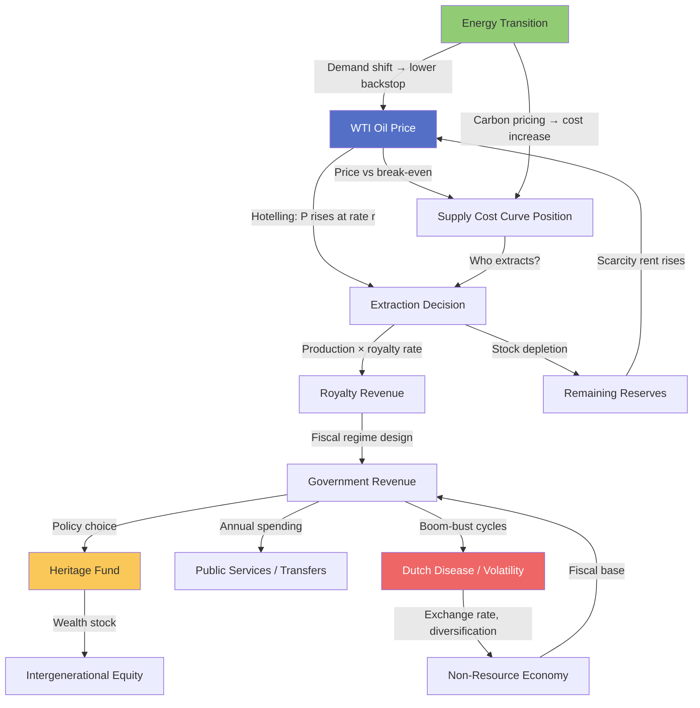

The previous four models in this cluster were deliberately isolated. Hotelling's rule was presented as a clean theory of price dynamics; the supply cost curve as an empirical snapshot of extraction economics; royalty regimes as fiscal design problems; the resource curse as a long-run growth pathology. Each is useful on its own. But Alberta's actual situation can only be understood by running all four simultaneously.

This final model does that synthesis. It builds the full causal system, traces three price scenarios through 2040, performs a sensitivity analysis of government revenues, and then adds the energy transition as an exogenous shift in the demand side — changing the terminal conditions that Hotelling's rule depends on.

## The Causal System

The integrated Alberta resource system has four main feedback loops. The primary extraction loop runs from oil price through the production decision to royalty revenues and government spending. The fiscal loop connects government revenues to Heritage Fund accumulation (or not) and public service capacity. The Dutch disease loop links resource revenues to exchange rate pressure and non-resource sector health. The transition loop introduces the energy transition as a demand-side force that eventually forces a Hotelling re-optimisation.

Reading the diagram: oil price feeds both the Hotelling extraction decision and determines who sits above the break-even threshold on the supply cost curve. Production generates royalty revenue, which flows into government revenue. The fiscal policy decision then either routes funds to the Heritage Fund or to current spending. Meanwhile, the boom-bust dynamics of resource dependency damage the non-resource economy through Dutch disease and volatility. The energy transition enters as an exogenous shift: it depresses demand (lowering the price path), raises production costs (through carbon pricing), and accelerates reserve depletion by shortening the economic window.

## Three Scenarios to 2040

The scenario analysis holds the supply cost curve and royalty regime constant and varies only the oil price trajectory. This isolates the price effect on all downstream variables.

**Scenario 1 — High Oil ($90+ WTI average):** Energy transition proceeds slower than expected, global demand remains elevated, pipeline capacity is sufficient. Alberta operates near full production capacity. Royalties are at post-payout rates. Government revenues are strong.

**Scenario 2 — Medium Oil ($65–75 WTI average):** Energy transition proceeds at the IEA "Stated Policies" pace. Global oil demand peaks around 2030 and slowly declines. Alberta production is roughly flat. Some high-cost mining projects are marginal. Government revenues are adequate but not generous.

**Scenario 3 — Low Oil ($45–55 WTI average):** Energy transition accelerates, EV adoption and industrial electrification reduce oil demand faster than expected. WTI falls as OPEC+ loses pricing discipline. Alberta SAGD operations are near or below full-cycle break-even. Several mining projects curtail production. Royalty revenues collapse.

The Hotelling price paths for these three scenarios:

$$P_{\text{High}}(t) = 90 + 5t \quad \text{(USD/bbl, from 2025)}$$
$$P_{\text{Medium}}(t) = 65 + 2t - 0.3t^2 / 10 \quad \text{(peaks around 2032, declines)}$$
$$P_{\text{Low}}(t) = 50 - 1.5t \quad \text{(gradual demand-driven decline)}$$

Each scenario produces a different government revenue profile, which then flows through to the Heritage Fund, program spending, and fiscal sustainability.

## Waterfall: How a $20 Price Change Flows Through the System

Before running the full scenarios, it is useful to understand the sensitivity of each system component to a $20 WTI price change. The waterfall chart traces this from wellhead to spending capacity.

The waterfall shows that a $20 WTI price change generates roughly $28 billion in additional gross revenue across Alberta's oil sector (at ~1.4 Mbd production). But operating costs, transport costs, and the WCS discount are largely fixed — they do not scale with price. So most of the price gain flows through to netback. The royalty capture (at an average effective rate of ~12%) is only $2.8 billion — reflecting how low Alberta's effective royalty rate is relative to gross revenues.

The Heritage Fund contribution depends on whether the government chooses to save. In reality, almost none of Alberta's recent boom revenues have been directed to the Heritage Fund — they have been used to eliminate the fiscal deficit accumulated during the bust.

## Scenario Revenue Projections 2025–2040

The spread between scenarios widens over time as the energy transition compounds the demand effect. By 2040, royalty revenues in the low-oil scenario have essentially collapsed to zero (operating costs exceed netback for most projects), while non-resource revenues (income taxes, federal transfers) remain relatively stable across all scenarios — they are not oil-dependent.

This is the core fiscal vulnerability: Alberta spends at the high-oil revenue level and then faces structural deficits when oil prices fall. The absence of a meaningful Heritage Fund means there is no buffer stock to smooth the transition.

## Sensitivity Table: Nine Combinations

The sensitivity analysis holds production fixed and varies the two most controllable policy variables — oil price (exogenous) and royalty rate (endogenous) — across a 3×3 grid.

| | Low Royalty (8%) | Mid Royalty (15%) | High Royalty (25%) |
|---|---|---|---|
| **Low Oil ($50)** | $2.8B | $5.2B | $8.7B |
| **Mid Oil ($70)** | $5.6B | $10.5B | $17.5B |
| **High Oil ($90)** | $8.4B | $15.7B | $26.2B |

*Illustrative annual royalty revenues, CAD billion, assuming ~1.4 Mbd production*

The table reveals that doubling the royalty rate (from 8% to 15%) increases government revenues more than increasing the oil price by $20/bbl at the same royalty rate. Fiscal regime design is a larger lever than oil price — within any given price environment, the government has more control over rent capture than over the commodity cycle.

## The Energy Transition Overlay

The energy transition changes the Hotelling analysis in two ways:

**Demand-side:** The backstop price $\bar{P}$ is falling as renewable energy, electric vehicles, and green hydrogen become cheaper. The IEA estimates that in a Net Zero scenario, the price of oil-equivalent energy from alternatives reaches $45–60/bbl by 2040. If this becomes the backstop, the entire Hotelling price path shifts down — and the optimal extraction strategy is to front-load production now, before the backstop arrives.

**Cost-side:** Carbon pricing adds a cost penalty to extraction. At $80/tonne CO₂, the oil sands (which emit roughly 0.04–0.08 tonnes CO₂ per barrel of production emissions) face an additional $3–6/bbl in carbon costs. For thin-margin high-cost operations, this can tip the economics.

The interaction is important: a falling backstop price argues for faster extraction now; a rising carbon cost argues for slower extraction (reduces the net price). These two forces partially offset but do not cancel — the net effect is to compress the economically viable window for oil sands development from "decades" to "perhaps 15–20 years."

The revised Hotelling condition with carbon pricing $\tau(t)$ is:

$$\frac{d(P - c - \tau)}{dt} = r(P - c - \tau)$$

where $\tau(t)$ is the carbon price per barrel (rising over time under most carbon pricing regimes). A rising $\tau$ compresses the net price growth rate, which — all else equal — makes earlier extraction relatively more attractive. This is the "extract now before the window closes" argument that drives current production expansion despite ESG concerns.

## Alberta Oil Sands Regions

The three major oil sands deposit areas in Alberta have distinct production profiles and dominant extraction methods:

**Athabasca** (Fort McMurray region) is the largest deposit and the only one with bitumen close enough to the surface for open-pit mining. It accounts for roughly 85% of current oil sands production. The mining operations (Suncor, CNRL Horizon, Imperial Kearl) have high capital costs but low OPEX once operating; SAGD operations in the deeper Athabasca formation have lower capital but higher energy costs.

**Cold Lake** is entirely in-situ recovery (Cyclic Steam Stimulation, a variant of SAGD) operated primarily by Imperial Oil. Break-even costs are slightly lower than Athabasca SAGD; the deposit is smaller.

**Peace River** has the thickest bitumen deposits but also the deepest and most geologically complex — making extraction difficult and expensive. Most Peace River projects are in early stages or have been deferred.

Understanding this geography matters for the supply cost analysis: the three regions sit at different points on the cost curve, and energy transition pressures will reach them in different order. Peace River projects are already stranded under most medium-oil scenarios.

## What the Integrated System Tells Us

Running all four models together produces several conclusions that no individual model could generate:

**Conclusion 1: The rent capture failure is the most actionable problem.** Alberta cannot control the oil price or the energy transition timeline. It can control the royalty rate. The sensitivity table shows that moving from an 8% effective royalty rate to 15% would add $5–10 billion annually at current prices — enough to fund a credible Heritage Fund accumulation. This is a policy choice, not a geological constraint.

**Conclusion 2: The Hotelling rule argues for faster extraction as the transition accelerates.** The energy transition is lowering the backstop price and shortening the economically viable window. Optimal control theory says: extract more now. But this conflicts with the resource curse logic (diversify, slow down) and the royalty regime logic (capture rent before it evaporates). The three models give contradictory policy signals.

**Conclusion 3: The non-resource fiscal base is Alberta's genuine long-run asset.** The sensitivity analysis shows non-resource revenues of $42–54 billion — larger and more stable than royalty revenues in all but the high-oil scenario. Alberta's income tax revenue, corporate tax from non-oil sectors, and federal transfer payments are the foundation; oil is a bonus, not the base. Policy that treats oil as the base and the rest as supplementary has the fiscal structure exactly backwards.

**Conclusion 4: The staples trap is sticky.** The capabilities created by oil sands development — reservoir engineering, heavy equipment operations, project finance — have limited relatedness to the capabilities needed for economic diversification. The transition requires deliberate investment in building new capability clusters, not just waiting for market forces to redirect existing capabilities.

The integrated resource system is not a pessimistic model. It is a realistic one. Alberta has genuine advantages — world-class geological resources, strong engineering talent, robust legal institutions, and geographic proximity to the largest economy in the world. The question is whether the fiscal and political system can be redesigned to translate finite resource wealth into permanent economic capacity before the energy transition closes the window.

---

**This completes Cluster RE — Resource Economics.** The cluster models read in sequence: Model 16 (Hotelling rule) → Model 17 (supply cost curves) → Model 18 (royalty regimes) → Model 19 (resource curse) → Model 20 (integrated system). Returning to Model 16 after reading Model 20 reveals how each piece of the derivation connects to the real outcomes tracked in this synthesis.
