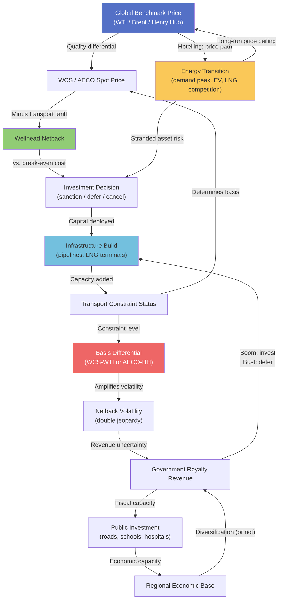

A price surface is a useful way to think about commodity markets in space. Imagine a topographic map where elevation represents the price a producer receives for their commodity. The highest elevations are at demand centres — Gulf Coast refineries, European LNG terminals, Asian steel mills — where buyers are concentrated and supply is easiest to access. The price surface slopes downward as you move toward supply sources, reflecting transport costs. Where quality is poor or export infrastructure is constrained, the surface dips further.

Alberta sits in a basin on the global crude oil price surface. Every model in this cluster has described one force that pulls that basin deeper: benchmark formation (Model 21) set the reference from which all deductions are taken; spatial arbitrage (Model 22) showed that transport constraints prevent prices from equalising; futures markets (Model 23) revealed how forward curves encode the persistence of those constraints; volatility analysis (Model 24) showed that the basin deepens further precisely when global prices fall. This final model assembles those forces into one integrated causal system, maps Alberta's position on the price surface, and runs three scenarios for how infrastructure investment might change it.

## The Causal System

The five models in this cluster form a closed causal loop. Starting from the global benchmark price, each step modifies what Alberta actually receives — and the endpoint (wellhead netback) determines what investment is economically viable, which in turn determines what infrastructure gets built, which determines what transport costs are, which determines the basis differential, which feeds back into the netback.

Reading the diagram: the global benchmark enters at top left and propagates rightward through quality adjustment and transport costs to the wellhead netback. The netback determines investment viability, which drives infrastructure decisions, which determine transport constraints, which circle back to determine the basis differential and thus the spot price. Government revenues are derived from the netback, cycle through public investment capacity, and feed back (weakly) into the regional economic base. The energy transition enters from outside the system as a demand-side force — lowering the long-run price ceiling and raising stranded asset risk, which modifies investment decisions upstream.

## The Price Surface: A Geographic Map of Value

The price surface for Western Canadian oil can be constructed from the four models. For a producer at location $x$ selling into benchmark $B$ at hub $H$:

$$P(x) = P_B - \Delta_q(x) - T(x, H) - \Phi(x, t)$$

where:
- $P_B$ is the benchmark price at hub $H$ (WTI at Cushing or Brent at Sullom Voe)
- $\Delta_q(x)$ is the quality discount at $x$ (a function of API gravity and sulphur content of the crude produced at $x$)
- $T(x, H)$ is the transport cost from $x$ to the relevant market hub
- $\Phi(x, t)$ is the basis differential at time $t$ — the excess price gap above competitive transport costs, reflecting constraint severity

The price surface is not static: it shifts with the benchmark, tilts as transport costs change, and deepens in basins when constraints bind ($\Phi > 0$). When Trans Mountain runs at full capacity, $\Phi$ widens for Alberta production. When LNG Canada is at full utilisation, $\Phi$ for Alberta gas narrows as an alternative export route opens.

The total penalty for an Athabasca oil sands producer relative to a Permian Basin producer at the same WTI benchmark is approximately:

$$\text{Total Penalty} = \Delta_q + T_{\text{Athabasca}} - T_{\text{Permian}} + \Phi_{\text{Athabasca}}$$

$$\approx \&#36;14 + (\&#36;8 - \&#36;3.50) + \&#36;2 \approx \&#36;20.50/\text{bbl}$$

This &#36;20.50/bbl penalty is the price of geography and geology. Of that total, roughly &#36;14 is geology (quality penalty), &#36;4.50 is geography (transport differential), and &#36;2 is infrastructure constraint (excess basis). Policy can address the infrastructure component and partially the transport component (by adding alternative export routes). It cannot address the quality penalty — that is determined by the physics of the deposit.

## Scenario Analysis: Alberta's Wellhead Netback 2025–2030

The scenario analysis varies two dimensions:
1. **Infrastructure outcome** — how much new export capacity is built and when
2. **WTI price path** — held roughly constant at &#36;70–75/bbl to isolate the infrastructure effect

**Scenario 1 — New Export Routes:** Trans Mountain Expansion running at full capacity (890,000 bbl/day), LNG Canada Phase 1 at 1.8 Bcf/day, and completion of Coastal GasLink. This opens substantial new West Coast market access, reducing both pipeline constraints and basis differentials.

**Scenario 2 — Status Quo:** Trans Mountain Expansion operational but utilisation limited by upstream NGTL constraints and export demand. LNG Canada partially ramping up. No additional liquids pipeline capacity beyond 2024.

**Scenario 3 — Infrastructure Stress:** A major pipeline disruption (modelled on a six-month Enbridge Line 5 shutdown plus delayed TMX ramp-up) reduces effective export capacity through 2026–27 before recovery. The basis differential widens sharply during the disruption period.

The three scenarios diverge in 2025–2027 — the critical window for Trans Mountain ramp-up and LNG Canada commissioning. In Scenario 1, the netback gap between WTI and the Alberta wellhead narrows from ~&#36;23/bbl to ~&#36;11/bbl as new export routes open and the basis differential compresses. In Scenario 3, the stress case, the netback drops to &#36;38/bbl in 2026 — barely above full-cycle break-even for oil sands mining — before recovering as the disruption clears.

The difference between Scenario 1 and Scenario 2 over the 2025–2030 period represents approximately &#36;4–6/bbl additional netback for Alberta producers from new infrastructure. At roughly 1.4 million barrels per day of oil sands production, that is &#36;2.0–&#36;3.1 billion per year in additional producer revenue — and at a 12% royalty rate, &#36;240–&#36;370 million per year in additional government royalties. The infrastructure investment pays off in captured rent, not just in producer margins.

## The Heatmap Price Surface

The price surface concept can be visualised as a heatmap across producing regions and price scenarios. Each cell shows the representative wellhead netback for a region under a given WTI scenario.

The heatmap makes the geography of price explicit. At every WTI scenario, Alberta oil sands producers receive the lowest netback of any major producing region — not because they are inefficient, but because the price surface dips deepest at their location. The Permian Basin and North Sea producers receive 85–92% of their relevant benchmark at the wellhead. Alberta oil sands producers receive 55–70%, depending on the price level and infrastructure scenario.

The Peace River row is instructive: at &#36;50 WTI, the netback (&#36;8/bbl) is below the operating cost threshold for most Peace River projects — these deposits are effectively uneconomic at low prices and remain on the supply cost curve's unproduced segment. This is the supply cost curve from the RE cluster made spatial: different parts of Alberta's resource base activate at different price levels.

## The Pipeline Network as Price Geography

The Leaflet map shows the key price formation nodes in the Western Canadian sedimentary basin corridor — the physical geography that underlies the price surface.

The map reveals the structural geometry of Alberta's price problem. Hardisty is the price formation point — WCS is priced there, reflecting transport costs to Cushing in the east, to the Gulf Coast via Enbridge, and to tidewater via Trans Mountain. Every route has a tariff, and every tariff subtracts from the Hardisty price.

Before Trans Mountain Expansion, effectively all of Alberta's oil moved east or south — toward US refineries designed to run heavy sour crude. Westridge Marine Terminal changes the geometry: it opens a third route, to Pacific refineries and to the global Brent-linked price system. Even at modest utilisation, a third route reduces the leverage of any single pipeline and provides the competitive pressure that compresses basis differentials.

## The Infrastructure Feedback Loop

The most important insight from the integrated system is the **infrastructure feedback loop**, which the causal diagram above captures but deserves explicit elaboration.

When Alberta wellhead netbacks are depressed — by low WTI prices, widened basis differentials, or both — the financial capacity for new infrastructure investment is also depressed. Pipeline projects require certainty of throughput commitments from producers; producers will not commit to long-term take-or-pay contracts if their netbacks are thin and margins uncertain. The result: infrastructure is hardest to build when it is most needed, and easiest to build when it is least needed.

This is a self-reinforcing trap. The mathematical structure is:

$$\frac{d\Phi}{dt} = f(\text{Investment}) < 0 \quad \text{(investment reduces the constraint)}$$
$$\frac{d\text{Investment}}{dt} = g(\text{Netback}) > 0 \quad \text{(higher netbacks enable more investment)}$$
$$\text{Netback} = P_{\text{WTI}} - \Delta_q - T - \Phi \quad \text{(constraint raises the basis, reducing netback)}$$

The feedback is: high $\Phi$ → low netback → low investment → $\Phi$ stays high → low netback → ... The system has a stable bad equilibrium (high basis, low investment, low netback) and a stable good equilibrium (low basis, high investment, high netback). Transitioning between them requires either an external price shock large enough to make investment irresistible, or a policy intervention that breaks the coordination failure.

Trans Mountain Expansion was the policy intervention. It required government ownership to proceed — no private investor would commit capital under the regulatory and financial uncertainty of 2018–2019. Whether that was the correct intervention, or whether a different policy (royalty reform, Heritage Fund capitalisation, economic diversification) would have been higher value, is a separate question. The economic structure makes clear why the trap exists.

## The Energy Transition Signal in Forward Prices

The Hotelling rule from the RE cluster resurfaces here in the forward curve. If global oil demand peaks in the late 2020s (as most IEA scenarios project in the "Stated Policies" and "Announced Pledges" cases), the oil price path is not rising at the rate of interest as pure Hotelling would predict. It is rising and then falling — a hump-shaped trajectory — as demand growth first supports prices and then demand decline drives them down.

The forward curve for WTI already encodes some of this expectation. Crude oil futures curves are typically in modest backwardation at the long end — 5-year and 10-year forward prices are often below current spot prices. This is partly convenience yield, but partly the market's genuine expectation that long-run demand growth is limited and supply will remain abundant.

For Alberta, the energy transition signal in forward prices implies a tightening window for infrastructure investment to generate positive returns. A pipeline built today and amortised over 30 years will operate into a post-peak-demand world. Whether the throughput volume assumptions that justify the capital cost will hold for 30 years is the core uncertainty — and it is an uncertainty the forward curve cannot fully resolve, because liquid futures markets only extend 5–10 years forward.

## Closing the Series: What Five Clusters Have Built

This is the twenty-fifth model in the Economic Systems series, and the fifth in Cluster MK. It is a good moment to look back at what the series has assembled.

**Cluster EP — Energy Production** (Models 1–5) established the physical and economic foundations: how energy is extracted, what determines production costs, how break-even curves shape the supply response to price, and why landlocked producers face structural disadvantages. The EP netback calculation — the price a producer actually receives after all deductions — introduced the concept that this cluster has now fully formalised.

**Cluster TR — Trade and Corridors** (Models 6–10) scaled the analysis to the level of trade flows: how commodities move between regions, what transport modes cost, how gravity models predict trade volumes, and why port economics and corridor constraints shape the geography of commerce. The TR cluster made explicit that corridors are not neutral — the capacity and cost structure of pipelines, railways, and ports determines who captures economic surplus.

**Cluster UR — Urban Economics** (Models 11–15) shifted from resource production to urban economic structure: bid-rent models, economic base theory, agglomeration economies, city-size distributions. It established that the same spatial price logic that determines commodity netbacks also determines where firms locate, how cities grow, and why density generates productivity.

**Cluster RE — Resource Economics** (Models 16–20) integrated resource extraction with fiscal and development economics: Hotelling's rule for optimal extraction timing, supply cost curves, royalty regimes, the resource curse, and the full fiscal system under three oil price scenarios. It showed that Alberta's fiscal situation is not a product of geology but of policy choices about rent capture and spending.

**Cluster MK — Markets and Price Formation** (Models 21–25) has now completed the price formation layer: how benchmarks are set, how spatial arbitrage (when it works) integrates markets, how futures curves encode time and geographic constraints, how volatility is measured and transmitted, and how all of these forces combine in the integrated price system that determines what Alberta's producers actually receive.

The reader who has worked through all five clusters has a toolkit for quantitative economic geography: they can take a physical location, characterise its cost structure, identify the relevant market benchmarks, calculate the transport and quality penalties, read the basis differential as an infrastructure signal, model the volatility exposure, and project fiscal scenarios under alternative price and infrastructure assumptions. That toolkit does not give simple answers — economic geography rarely does. But it gives the right questions, and a rigorous framework for pursuing them.

---

**This completes Cluster MK — Markets and Price Formation.** The cluster reads in sequence: Model 21 (commodity price formation) → Model 22 (spatial arbitrage) → Model 23 (futures as geographic instruments) → Model 24 (price volatility) → Model 25 (integrated price system). Together with the four prior clusters, it forms a complete quantitative treatment of how geography, infrastructure, and markets interact to determine economic outcomes in resource-dependent regions.

## References

Canada Energy Regulator. 2024. "Crude Oil Price Differential." Government of Canada. <https://www.cer-rec.gc.ca/en/data-analysis/energy-commodities/crude-oil-petroleum-products/crude-oil-price-differential/>

CME Group. 2025. "Light Sweet Crude Oil (WTI) Futures." NYMEX. <https://www.cmegroup.com/markets/energy/crude-oil/light-sweet-crude.html>

Hotelling, Harold. 1931. "The Economics of Exhaustible Resources." *Journal of Political Economy* 39 (2): 137–175. <https://doi.org/10.1086/254195>

ICE Futures Europe. 2025. "Brent Crude Futures." Intercontinental Exchange. <https://www.ice.com/products/219/Brent-Crude-Futures>

International Energy Agency. 2023. *World Energy Outlook 2023*. Paris: IEA. <https://www.iea.org/reports/world-energy-outlook-2023>

LNG Canada. 2024. "Project Overview." LNG Canada Development Inc. <https://www.lngcanada.ca/project/>

Samuelson, Paul A. 1952. "Spatial Price Equilibrium and Linear Programming." *American Economic Review* 42 (3): 283–303. <https://www.jstor.org/stable/1907862>

Trans Mountain Corporation. 2024. "Trans Mountain Expansion Project." Trans Mountain Corporation. <https://www.transmountain.com/expansion-project>

World Bank. 2025. "Commodity Markets (Pink Sheet)." World Bank Group. <https://www.worldbank.org/en/research/commodity-markets>
